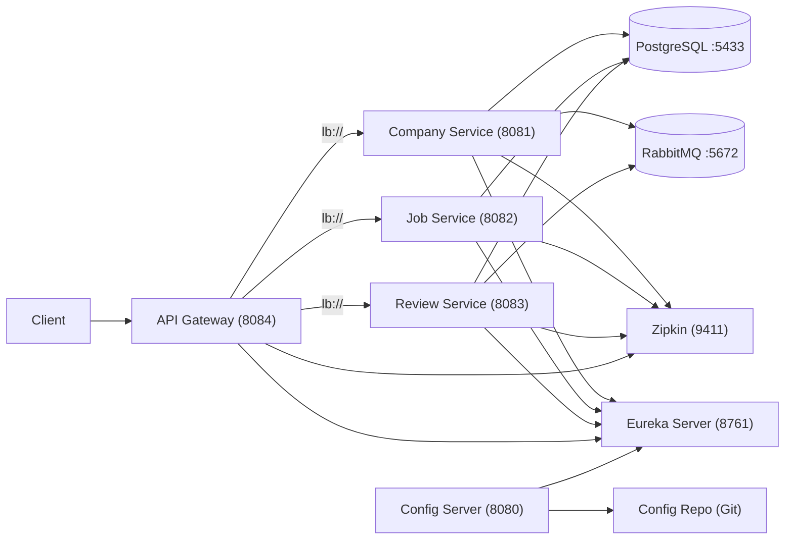

# JobApp Microservices

Platform microservices berbasis Spring Boot + Spring Cloud untuk domain job application: Company, Job, dan Review, dengan service discovery, centralized configuration, API gateway, tracing, messaging, dan database.

## Architecture



## Tech Stack

- Java 21
- Spring Boot 3.5.14
- Spring Cloud 2025.0.2
- Maven
- PostgreSQL, RabbitMQ, Zipkin

## Modules

- `service-reg`: Eureka Server
- `configserver`: Spring Cloud Config Server (Git-backed)
- `gateway`: Spring Cloud Gateway (routing via Eureka LB)
- `companyms`: Company Service (JPA + Postgres + AMQP + OpenFeign)
- `jobms`: Job Service (JPA + Postgres + OpenFeign + Resilience4j)
- `reviewms`: Review Service (JPA + Postgres + AMQP)

## Services & Ports

| Service | Module | Port |
|---|---|---|
| Eureka Server | `service-reg` | `8761` |
| Config Server | `configserver` | `8080` (default) |
| API Gateway | `gateway` | `8084` |
| Company Service | `companyms` | `8081` |
| Job Service | `jobms` | `8082` |
| Review Service | `reviewms` | `8083` |
| PostgreSQL (Docker) | `postgres` | `5433 -> 5432` |
| pgAdmin (Docker) | `pgadmin` | `5050 -> 80` |
| Zipkin (Docker) | `zipkin` | `9411` |
| RabbitMQ (Docker) | `rabbitmq` | `5672`, `15672` |

## Gateway Routes

Gateway route berdasarkan path:

- `/companies/**` -> `lb://company-service`
- `/jobs/**` -> `lb://job-service`
- `/reviews/**` -> `lb://review-service`
- `/eureka/**` -> Eureka UI proxy (via gateway)

Base URL Gateway: `http://localhost:8084`

## Prerequisites

- Java 21
- Maven
- Docker Desktop (untuk PostgreSQL / RabbitMQ / Zipkin / pgAdmin)

## Getting Started (Local)

### 1) Jalankan dependencies (Docker)

```bash
docker compose up -d
```

### 2) Jalankan microservices (urut recommended)

1. Eureka Server

```bash
cd service-reg
mvn spring-boot:run
```

2. Config Server

```bash
cd configserver
mvn spring-boot:run
```

3. Gateway

```bash
cd gateway
mvn spring-boot:run
```

4. Business services

```bash
cd companyms
mvn spring-boot:run
```

```bash
cd jobms
mvn spring-boot:run
```

```bash
cd reviewms
mvn spring-boot:run
```

## Useful URLs

- Eureka: `http://localhost:8761`
- Gateway: `http://localhost:8084`
- Zipkin: `http://localhost:9411`
- RabbitMQ Management: `http://localhost:15672` (guest/guest)
- pgAdmin: `http://localhost:5050` (default: pgadmin4@pgadmin.org / admin)

## Database Notes

Service menggunakan PostgreSQL via Docker pada host port `5433`.

DB name (sesuai JDBC URL di masing-masing service):

- Company Service: `company`
- Job Service: `job`
- Review Service: `review`

Catatan: field `spring.datasource.username` dan `spring.datasource.password` pada `companyms/jobms/reviewms` masih kosong di `application.yaml`, jadi isi lewat:

- edit `application.yaml`, atau
- pakai environment variables, atau
- lewat Config Server (recommended untuk setup microservices).

## Config Server

Config Server membaca konfigurasi dari repo Git:

- `https://github.com/Mustofaadni04040/application-config/`

## Observability (Tracing)

Tracing dikirim via Micrometer Tracing (Brave) dan bisa dilihat di Zipkin:

- Zipkin UI: `http://localhost:9411`
